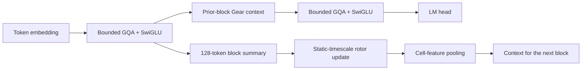

# Block-rate Hybrid Gear V4/V4.1 report

Date: 2026-06-21

## Architecture

V4 removes token-rate rotor scans. Local attention handles token interactions;
constant-state Gear memory updates once per completed 128-token block. A block
never reads memory produced from its own tokens.

V4.1 moves the Gear injection between bounded blocks so downstream attention
and the FFN can process the long-memory context. The static rotor retains the
four structural timescale bands, log-spaced periods, alternating direction,
input-controlled writes, normalized cell pooling, and constant recurrent
state.

Training uses contiguous whole-document windows. This preserves state across
adjacent windows and exact document resets without packing multiple unrelated
documents into one recurrent lane.

## Engineering qualification

Artifact:
`outputs/pure_parallel_gear_v4_1/qualification_fp32_isolated.json`

V4 passed:

- output/gradient scan proofs;
- full, chunked, and token-streaming parity;
- parameter matching within 0.5%;
- training throughput above 50% of full Transformer;
- incremental generation above 1.5x full Transformer;
- bounded cache below 25% of full Transformer.

At the matched qualification shape, V4.1 reached 47,627 training tokens/s
versus 86,651 for full attention (55.0%), and 251 incremental tokens/s versus
130 (1.93x). Its 4K cache was 36,264 bytes versus 7,397,376 bytes.

The fused Metal token-rate scan is retained for streaming. It improves
single-token latency but is under-occupied for 512-token training, which is why
V4 uses block-rate updates.

## 200K-token screen

Artifact: `outputs/pure_parallel_gear_v4/screen_200k/results.json`

| Model | Mean macro NLL | Mean train tokens/s |
| --- | ---: | ---: |
| Block Hybrid V4 | 6.9830 | 27,460 |
| Bounded Transformer | 6.9893 | 34,046 |
| Full Transformer | 7.0204 | 35,796 |

V4 passed the 3% screening margin and reached 76.7% of full-Transformer
throughput.

## 1M-token confirmation

V4.1 artifact:
`outputs/pure_parallel_gear_v4_1/confirmation_1m/results.json`

| Model | Mean macro NLL | Mean train tokens/s |
| --- | ---: | ---: |
| Block Hybrid V4.1 | 6.3828 | 32,185 |
| Bounded Transformer | 6.3855 | 36,079 |
| Full Transformer | 6.4954 | 37,714 |

V4.1 is significantly better than the full-attention Transformer in the paired
three-seed interval and reaches 85.3% of its throughput. It is statistically
tied with the bounded Transformer:

- mean V4.1 minus bounded NLL: `-0.00269`;
- 95% paired interval: `[-0.06469, 0.05931]`.

The required Gear-removal result therefore fails. Removing Gear does not
measurably hurt quality at this scale. Scaling to 60M tokens is blocked by the
program gate.

## Remaining bottleneck

The unresolved P1 is architectural value, not execution speed. Bounded local
attention explains the measured quality gain over full attention. The current
rotor branch is active and inexpensive, but its incremental contribution is
not statistically established.

The next candidate should change how memory participates in prediction rather
than increase width or tune learning rates. The most defensible direction is a
token/channel-selective Gear-to-attention modulation with a retrained bounded
control carrying the same modulation parameter budget. It must restart at the
200K screen and still pass the Gear-removal test before scaling.
