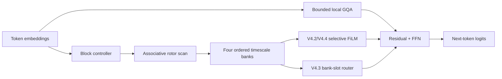

# Pure Parallel Gear remaining-program report

Date: 2026-06-21

## Scope completed

After V4.1 failed to prove that Gear added quality beyond bounded attention,
three further architecture paths were implemented and tested:

1. V4.2 token/channel-selective Gear FiLM.
2. V4.3 token retrieval from four persistent Gear bank slots.
3. V4.4 selective Gear with a shorter 64-token attention and update horizon.

All comparisons use parameter-matched models and retrained controls.

## Implemented architecture

V4.2 and V4.4 use the selective FiLM branch. V4.3 replaces it with the
bank-slot router. The bounded Transformer control uses the identical local
attention and FFN path with both Gear branches removed.

## V4.2 selective Gear modulation

Prior-block Gear context produces channel scale/shift controls. The controls are
computed once per block and broadcast across tokens; token hidden values still
determine the resulting modulation. This path remains constant-state outside
the bounded local KV cache.

At 1M training tokens:

| Model | Mean macro NLL | Mean train tokens/s |
| --- | ---: | ---: |
| Selective Gear V4.2 | 6.3337 | 27,667 |
| Bounded Transformer | 6.3293 | 36,136 |
| Full Transformer | 6.4295 | 37,605 |

V4.2 minus bounded Transformer:

- mean NLL difference: `+0.00441`;
- paired 95% interval: `[-0.02910, +0.03793]`.

The Gear-removal test failed.

Artifacts:

- `outputs/bounded_hybrid_gear/block_selective_film_dense/confirmation_1m/results.json`
- `outputs/bounded_hybrid_gear/block_selective_film_dense/confirmation_1m/gate.json`

## V4.3 fixed Gear-bank retrieval

Each token queries four persistent Gear bank summaries. This is explicit
constant-size memory retrieval rather than token-history attention.

The architecture was rejected before quality training:

- training throughput: 46.4% of full Transformer;
- generation and cache targets passed;
- the 50% engineering gate failed.

Artifact:
`outputs/bounded_hybrid_gear/block_bank_router/qualification_fp32_rank8.json`

## V4.4 64-token local horizon

The local attention window and Gear update interval were both reduced to 64
tokens so Gear alone could carry information beyond the local horizon.

At 1M training tokens:

| Model | Mean macro NLL | Mean train tokens/s |
| --- | ---: | ---: |
| Selective Gear V4.4 | 6.3664 | 30,624 |
| Bounded Transformer, window 64 | 6.3626 | 37,620 |
| Full Transformer | 6.4165 | 37,402 |

V4.4 minus bounded Transformer:

- mean NLL difference: `+0.00378`;
- paired 95% interval: `[-0.02307, +0.03064]`;
- throughput ratio to full Transformer: 81.9%.

V4.4 significantly beats the full-attention baseline but remains statistically
tied/slightly worse than the identical bounded-attention control. Gear removal
again does not measurably hurt.

Artifacts:

- `outputs/bounded_hybrid_gear/block_selective_film_w64/confirmation_1m/results.json`
- `outputs/bounded_hybrid_gear/block_selective_film_w64/confirmation_1m/gate.json`

## Final conclusion

The remaining implementation program is complete through the 1M confirmation
gate. The evidence supports bounded local attention as a faster and
higher-quality replacement for the repository's full-attention baseline at
this scale. It does not establish that the tested Gear mechanisms add quality
on top of bounded attention.

The 60M-token stage and larger scaling are blocked because the required
retrained Gear-removal ablation is not worse. Starting those stages would
violate the predefined acceptance protocol.

Unresolved P1:

- no statistically established incremental quality contribution from Gear.

Resolved engineering bottlenecks:

- token-rate MPS scan launch depth;
- recurrent cache size;
- local-attention sequence-square allocation;
- generation latency;
- stateful document continuation;
- packed-document reset correctness;
- structural timescale ordering.

No claim that Pure Parallel Gear beats Transformers is supported. The strongest
supported result is that the bounded Transformer control outperforms the
current full-attention Transformer implementation in quality, training speed,
generation speed, and cache size at the tested scale.

## Verification

- `24` focused V3/V4 tests pass.
- The complete repository test suite passes.
- The modified Python modules and experiment scripts compile successfully.
- `git diff --check` reports no whitespace errors.
- Qualification and confirmation artifacts include code/config/environment
  provenance and the failed gate is recorded explicitly rather than overridden.
