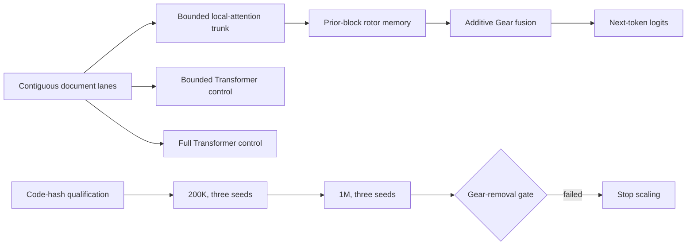

# Gear-family post-refactor audit and rerun

Date: 2026-06-21

Code hash:
`b6df9f9dfec8937548227b601c02403a07a598d647f627924361a3da9eb5fd99`

## Scope

This audit reviewed the actual model, cache, stateful trainer, data, evaluation,
checkpoint, qualification, screening, and Transformer-control code after the
LMF directory refactor. Historical documentation and results were not treated
as proof when they disagreed with executable code.

## Correctness and fairness defects fixed

| Priority | Defect | Consequence | Resolution |
| --- | --- | --- | --- |
| P0 | Block fast path fused cached Gear context before checking the new segment | First block of a new document consumed the previous document's memory | Mask prior block and bank context by segment before every fusion mode |
| P0 | Generic LM evaluation dropped `sentence_end_mask` | Pure Gear CLI/trainer evaluation omitted its boundary-clutch mechanism | Forward all supported boundary metadata |
| P0 | Full Transformer received segment IDs for certified single-document rows | Built an unnecessary sequence-square mask and disabled fused causal SDPA, biasing baseline speed downward | Omit segment masking only when `single_segment_rows=true` |
| P0 | Pure and Hybrid YAMLs lacked usable corpus wiring | Hybrid CLI failed; Pure Gear silently trained on the procedural fallback | Added explicit paired/contiguous corpus definitions |
| P0 | Immutable manifests embedded pre-refactor paths | Pure Gear data loading failed after directories moved | Added narrow relocation-aware path resolution without rewriting artifact hashes |
| P1 | Checkpoint guard contained only pre-refactor architecture names | `strict=false` could cross-load renamed Gear variants | Added current names and explicit version rejection |
| P1 | Pure Gear silently skipped non-finite-gradient updates | Equal-token schedules could advance without equivalent optimization | Non-finite gradients now fail immediately |
| P1 | Pure Gear forced FP32 while MPS Transformer controls could be BF16 | Precision-asymmetric quality comparison | Decisive Pure Gear comparisons now require common FP32 |
| P1 | Screening accepted stale or differently configured qualification files | Expensive runs could use unqualified code | Require matching code hash and instantiated candidate config |
| P1 | Qualification generation re-fed the prompt's final token | Measured a duplicated-token transition | Start from the model's predicted continuation |
| P1 | Training throughput omitted the optimizer step | Reported values were not end-to-end training throughput | Include zero-grad, forward, backward, and optimizer step |
| P1 | Peak memory was a post-backward snapshot | Could miss fused-attention transients | Poll MPS allocated memory every 0.5 ms through the entire step |
| P1 | Additive confirmation config inherited `heads=7` with `dim=128` | Configuration could not instantiate | Confirmation now extends tokens at the valid parameter-matched screen shape |
| P1 | Model vocabulary silently replaced a mismatched configured vocabulary | Scale labels could run with the wrong tokenizer size | Build now fails on model/corpus vocabulary mismatch |
| P2 | Generic repetition evaluation assumed RHCA's result object | Transformer/Pure tensor generation failed | Support both tensor and structured generation results |
| P2 | CLI `--steps 0` was treated as unspecified | Build-only smoke tests unexpectedly trained | Preserve explicit zero |
| P2 | Paired-manifest generation returned no decoded text | CLI output discarded an available tokenizer | Fall back to `corpus.tokenizer.decode` |

## Training-path bottleneck investigation

The first profiler pass found `aten::copy_` at 25.6% of Hybrid CPU dispatch
time. The dominant copy recreated four future-horizon offsets on MPS every
step. The model also computed the future-state objective after its effective
weight reached zero.

Fixes:

- horizons are now a device buffer;
- zero-weight future-state work is skipped.

After the fix, the largest profiled operations were `aten::sum` at 13.2% and
`aten::copy_` at 13.2%. No operation exceeded the 20% investigation threshold.

## Engineering qualification

Artifacts:

- `outputs/bounded_hybrid_gear/refactor_review/qualification_block_additive_fp32.json`
- `outputs/pure_parallel_gear/refactor_review/qualification_fp32.json`

### Block-rate Hybrid Gear

Parameter-matched M4 Max FP32, batch 2 × 512:

| Metric | Hybrid | Full Transformer | Ratio |
| --- | ---: | ---: | ---: |
| End-to-end training tokens/s | 45,047 | 48,348 | 0.932 |
| Incremental tokens/s at 4K | 275.8 | 135.9 | 2.03 |
| Generation cache | 36,456 B | 7,397,376 B | 0.0049 |
| Polled peak allocation | 114,968,576 B | 161,502,976 B | 0.712 |

Block Hybrid passes engineering qualification. Token-rate strict and hybrid
scan models still fail their throughput gates.

### Canonical Pure Parallel Gear

Matched at approximately 503K parameters:

| Metric | Pure Gear | Transformer | Ratio |
| --- | ---: | ---: | ---: |
| End-to-end training tokens/s | 436.7 | 21,411.6 | 0.020 |
| Incremental tokens/s | 50.2 | 481.8 | 0.104 |
| Cache ratio | — | — | 0.0047 |

Pure Gear passes mathematical, streaming, cache, FP32, and no-skip checks, but
fails both performance gates. Its CPU-planned sentence chunks and sequential
boundary settling remain architectural bottlenecks. Quality training is
blocked.

## Corrected quality rerun

All runs use the same tokenizer, immutable validation rows, three paired seeds,
parameter tolerance within 0.5%, and the corrected fused-causal full
Transformer baseline.

### 200K screen

| Model | Macro NLL | Training tokens/s |
| --- | ---: | ---: |
| Block Hybrid Gear | 7.0493 | 29,261 |
| Bounded Transformer | 7.0249 | 36,291 |
| Full Transformer | 7.0315 | 38,435 |

The screen passes the permissive 3% continuation margin.

### 1M confirmation

| Model | Macro NLL | Training tokens/s |
| --- | ---: | ---: |
| Block Hybrid Gear | 6.3253 | 30,005 |
| Bounded Transformer | 6.3085 | 40,283 |
| Full Transformer | 6.3897 | 38,160 |

Hybrid minus bounded Transformer:

- absolute mean NLL difference: `+0.01679`;
- paired 95% interval: `[-0.07589, +0.10946]`;
- relative mean difference: `+0.264%`;
- relative 95% interval: `[-1.198%, +1.726%]`.

Hybrid minus full Transformer:

- absolute mean NLL difference: `-0.06441`;
- paired 95% interval: `[-0.13884, +0.01002]`.

The final 1M gate fails:

- the upper relative bound against bounded attention exceeds 1%;
- removing Gear does not measurably hurt;
- Hybrid does not significantly beat full attention.

## Decision

No larger Hybrid or Pure Gear run is authorized by the evidence.

- Pure Parallel Gear is blocked by architecture-level execution speed.
- Block Hybrid Gear is efficient enough but has no established quality value
  beyond bounded local attention.
- The supported production control is `bounded_transformer`.
- Historical pre-audit Gear results are superseded for decision-making.

There are no unresolved P0 correctness defects found by this audit. The
unresolved P1 is the absence of statistically demonstrated Gear contribution.

## Verification

- The complete default repository test suite passes; 313 tests are collected.
- Focused regression tests cover document resets, boundary metadata, checkpoint
  incompatibility, non-finite gradients, configuration construction, and the
  corrected Transformer causal path.
- Python bytecode compilation and `git diff --check` pass.
- Qualification, screening, and confirmation artifacts use code hash
  `b6df9f9dfec8937548227b601c02403a07a598d647f627924361a3da9eb5fd99`.
