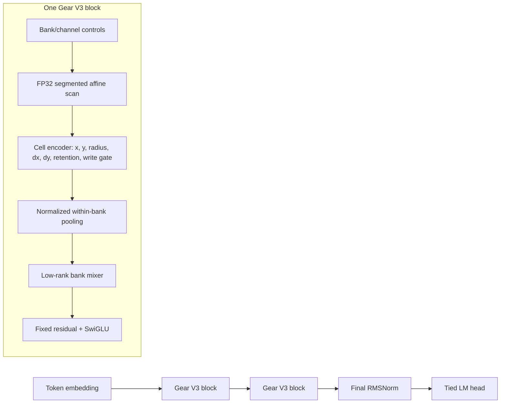

# Pure Parallel Gear V3 implementation and qualification

Date: 2026-06-21

## Implemented architecture

The hybrid inserts the shared 128-token grouped-query local-attention module
after every second Gear block. The bounded Transformer uses the identical local
attention and SwiGLU implementation without the Gear branch.

Implemented invariants:

- V2 remains a separate architecture and checkpoint family.
- Document reset is an affine transition with zero multiplier.
- Scan outputs and gradients match a sequential reference.
- Half-life and period bands are structurally bounded by bank.
- Periods are exactly log-spaced across gears with alternating direction.
- Strict V3 has constant state and no attention/history tensor.
- Hybrid and bounded Transformer use fixed 128-token KV caches.
- Full, chunked, and token-streamed logits agree in FP32.
- Stateful training carries two contiguous chunks before detaching.
- Future-state supervision uses horizons 4, 16, 64, and 256 and anneals away.
- Nonfinite losses or gradients fail immediately; optimizer steps are not
  skipped.

## M4 Max engineering qualification

Artifact:
`outputs/pure_parallel_gear_v3/qualification_final_fp32.json`

All models were parameter matched within 0.5% at approximately 776K parameters.
Training used batch 2 by 512 on MPS FP32. Incremental generation was measured
after a 4,096-token prefill.

| Model | Train tokens/s | vs full Transformer | Incremental tokens/s | vs full Transformer | 4K cache |
| --- | ---: | ---: | ---: | ---: | ---: |
| Full Transformer | 217,450 | 1.000 | 184.45 | 1.000 | 7,368,704 B |
| Bounded Transformer | 196,407 | 0.903 | 675.17 | 3.660 | 35,080 B |
| Hybrid Gear | 9,516 | 0.044 | 229.25 | 1.243 | 34,456 B |
| Strict Gear V3 | 9,694 | 0.045 | 234.90 | 1.274 | 536 B |

Passed:

- FP32 scan output and gradient proof.
- FP32 full/chunked/token streaming parity.
- Parameter matching.
- Strict constant cache.
- Hybrid bounded cache.
- Hybrid cache below 25% of full Transformer; measured ratio was 0.47%.
- Complete repository and V3-specific tests.

Failed:

- Strict and hybrid training throughput are far below the required 50%.
- Strict and hybrid incremental generation are below the required 1.5x.
- BF16 did not meet the 0.002 logit parity bound. FP32 fallback also failed the
  throughput recovery gate.

The 200K-token screening stage was therefore not started. The quality claim is
unmeasured for V3 and no Transformer-beating claim is supported.

## Bottleneck finding

The bounded Transformer reaches 90% of full-Transformer training throughput,
so bounded local attention is not the blocking component. Removing redundant
per-cell timescale projections and reducing the default rotor channels improved
Gear throughput, but only to about 4.5% of the full Transformer.

The unresolved P1 bottleneck is the differentiable segmented rotor scan and its
readout on MPS. It dispatches many small dependent tensor operations. The state
is small, but dependency depth and kernel-launch/synchronization cost dominate.
`torch.compile` did not materially improve the 2 by 512 result.

## Required next architecture work

Scaling is blocked until one of these is implemented and independently proven:

1. A fused Metal segmented affine-scan kernel with a fused backward, preferably
   combining transition decoding and rotor readout to avoid intermediate state
   traffic.
2. A new block-rate hybrid long-memory branch whose Gear state updates once per
   local-attention block, with exact document-reset handling and streaming
   parity. This changes the architecture and must be compared against the
   bounded Transformer control.
3. A hardware-efficient static- or block-selective rotor recurrence trainable
   by convolution/parallel filtering, while retaining recurrent constant-state
   generation. This is a V4 hypothesis, not a configuration change.

No amount of learning-rate, batch-size, or width tuning resolves the measured
dependency/kernel-launch bottleneck. Quality scaling before fixing it would
violate the program gate.
